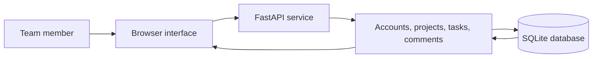

# CodeAlpha Project Management

<strong>A project and task-management prototype with a FastAPI backend, relational records, and a browser interface.</strong>

Python · FastAPI · SQLite · HTML/CSS/JavaScript

## Project overview

The backend in `backend/app/main.py` defines registration/login, project membership, tasks, and task comments, backed by SQLite tables. The repository includes a frontend entry page, screenshots, and a recorded deployment demo.

## Architecture

## Run and deployment status

Python dependencies are listed in `backend/requirements.txt`; the included Dockerfile declares port `7860`. Before deploying, review its build context and `/data` database path: the current Docker `COPY` statements expect a specific context, and SQLite persistence requires a mounted writable volume.

This is a learning prototype. Review authentication, password storage, token persistence, CORS, and database configuration before exposing it to real users. Do not use it as a production team workspace without that work.

## Project media

- [Recorded demo](httpsca-project-mgmt.vercel.applogin.mp4)
- [Interface capture](httpsca-project-mgmt.vercel.applogin.png)

## Project structure

- `backend/app/main.py` — FastAPI routes and SQLite setup
- `backend/requirements.txt` — Python packages
- `backend/Dockerfile` — container recipe
- `frontend/index.html` — browser interface entry page
